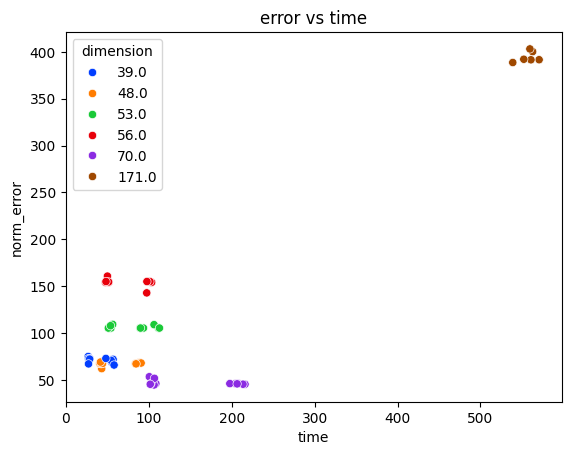

# :briefcase: Methods of solving TSP

This repository contains implementation of the following algorithms for solving Traveling Salesman Problem in asymmetric case as a part of *Game Theory and Operations Research* course at St. Petersburg State University:
* Branch and Bound
* Particle Swarm Optimization
* Ant Colony Optimization

Algorithms have been tested on [TSPLIB benchmark](http://comopt.ifi.uni-heidelberg.de/software/TSPLIB95/).

## :bulb: Particle Swarm Optimization
There are two versions of the algorithm available. First is draft implementation and may stuck in local minima. Second attempts to escape local minima by reinitializing all particles' velocities and positions.

:memo: Benchmark table:

| dimension | var_norm_error | mean_norm_error |      0.25 |       0.5 |      0.75 |           |
|----------:|---------------:|----------------:|----------:|----------:|----------:|-----------|
|     0     |             34 |        2.986226 | 11.396721 |  9.639344 | 11.016393 | 13.442623 |
|     1     |             36 |        7.056806 | 17.611902 | 15.920651 | 17.980671 | 19.544761 |
|     2     |             39 |       13.097482 | 16.399309 | 15.140671 | 16.535044 | 18.447680 |
|     3     |             43 |        0.041357 |  0.905772 |  0.795376 |  0.921419 |  1.095271 |
|     4     |             45 |        0.000000 | 11.616438 | 11.616438 | 11.616438 | 11.616438 |
|     5     |             48 |        7.695274 | 14.775635 | 12.333736 | 13.780042 | 16.736842 |
|     6     |             53 |        0.551221 | 24.387939 | 23.757376 | 24.332433 | 24.914991 |
|     7     |             56 |        3.166527 | 21.150067 | 19.785619 | 20.388566 | 22.208575 |
|     8     |             65 |        0.384365 | 19.261874 | 18.656397 | 19.169876 | 19.726145 |
|     9     |             70 |        0.069645 |  9.595812 |  9.449680 |  9.579988 |  9.848749 |
|     10    |             71 |        3.037692 | 24.226213 | 23.691250 | 24.914024 | 25.487199 |
|     11    |            171 |        0.032629 | 25.833782 | 25.887574 | 25.901022 | 25.901022 |
|     12    |            323 |        0.098274 | 27.252911 | 27.111717 | 27.193460 | 27.411444 |
|     13    |            358 |        0.034525 | 24.893617 | 24.887170 | 24.951644 | 25.016119 |
|     14    |            443 |        0.008060 |  9.711443 |  9.684909 |  9.751244 |  9.784411 |

:triangular_ruler: Optimality curve:

## :deciduous_tree: Branch and Bound

Gives exact solutions for a number of dimensions: `[17, 34, 36, 39, 45, 48]`. It takes a considerable amount of time for this method to solve higher dimension problems.

## :ant: Ant Colony Optimization

Permorms poorly in comparison to other methods.

